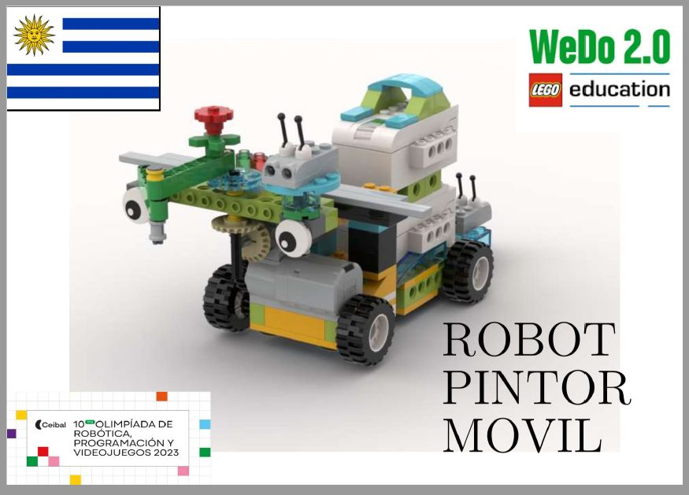
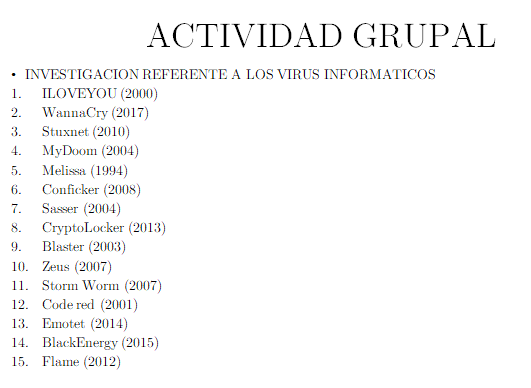
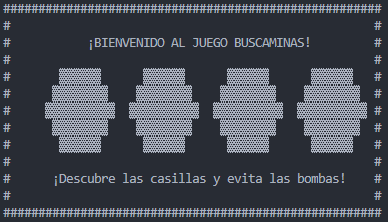

# 👋 Alan Placeres
### **Teacher of Programming, Robotics, Computer Science & Full Stack Developer**

## 🎯 Professional Profile

ORT Engineering student, teacher of programming, computer science, and educational robotics. Professional with solid experience in **Python**, **C++/C***, **HTML5**, **Pascal**, and **JavaScript**.

Proficient in educational hardware technologies (**Micro:bit, Lego Education Spike Prime and Wedo 2.0, Tinkercad, Arduino**) combined with a proven ability for teaching and technical communication.

---

## 🛠 Technical Skills

### **Programming Languages Programming**

### **Platforms & Frameworks**

### **Science of Data**

---

## 💼 Professional Experience

### **👨‍🏫 Professor and Developer of Technological Projects**
**Maria Auxiliadora Institute (IMA)** | April 2023 - Present

- 🎯 Designed and implemented **more than 12 integrated projects** in programming and robotics
- 🚀 Developed simulation platforms that **improved the understanding** of abstract concepts
- 👥 Trained more than **80 students** in logical thinking and problem-solving
- 🏆 Continuous participation in **CEIBAL STEM Robotics Olympiads**

### **💻 Technology Coordinator and Teacher**
**Divina Pastora Institute** | October 2023 - December 2024

- 🆕 I introduced **programming, robotics, and 3D design** for the first time at the school
- 🎮 Students developed **functional video games in Scratch** from scratch
- 🔬 We implemented a **humidity sensor with Micro:bit** - our first IoT experience
- 🛡️ I designed a **digital security workshop** for teenagers

### **🤖 Programming Teacher - STEM Team**
**Seminario School** | March 2024 - February 2025

- ♿ I collaborated on a **STEM accessibility project**: ramp measurement with Micro:bit
- 🎯 Results **led to the construction of new accessible ramps**
- 💣 Students created a **100% functional Minesweeper in Python**
- 📊 I supervised **technical reports** integrating programming and data analysis

---

## 🚀 Featured Projects

### **🎮 OOP Role Play (Python)** Video game implementing OOP, hierarchies, and advanced classes

### **💣 Minesweeper (Python)**
Complete implementation of game logic and efficient algorithms

### **🖥️ Local Server (C++/C)**
Development of advanced data structures for servers

### **🏨 Hotel Vista Mar (Python)**
Complete management system with hierarchies and diagrams

---

## 🎓 Education & Certifications

### **📚 Studies**
- **ORT Uruguay University** - Information Technology Analyst (In progress)
- **BIOS** - PC and Network Repair Technician (Completed)
- **University of the Republic** - Computer Engineering (In progress)

### **🏅 Certifications**
- **Object-Oriented Programming** - Edutin Academy
- **MakeCode Arcade & Scratch 3.0** - Ceibal

---

## 📞 Contact

Interested in collaborating or have any questions? Don't hesitate to contact me:

- 📧 **Email:** [aplaceres28835@gmail.com](mailto:aplaceres28835@gmail.com)
- 💻 **GitHub:** [Panteralan](https://github.com/Panteralan)
- 📱 **WhatsApp:** [+598 96 057 810](https://wa.me/59896057810)
- 🎥 **YouTube:** [UdelAlan](https://www.youtube.com/@alanleonelplaceresruizdiaz5870)

---

### ⭐ "Teaching is not transferring knowledge, but creating the possibilities for its production." - Paulo Freire

